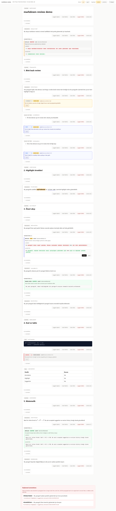

# markdown-review

> **Review Markdown like a code review — annotations, highlights, suggestions, and source edits, all tracked in a sidecar JSON file.**

A block-level Markdown review tool that renders any `.md` file in a local web UI. You highlight text, leave comments, propose source changes, and an AI agent replies — everything stored alongside your document in `<doc>.annotations.json`. No database, no setup, no noise.

---

## What does it look like?



<p align="center">
  <em>Run <code>markdown-review demo.md</code> to see it live — <code>demo.md</code> is pre-seeded with annotations, highlights, and suggestions.</em>
</p>

---

## Why?

| Problem | markdown-review |
|---|---|
| Review comments scattered across GitHub issues, Slack, and email | Everything lives in one sidecar JSON, next to the doc |
| Can't comment on individual list items or code blocks | Every block gets its own review ID — paragraphs, headings, lists, code, tables, equations |
| No history of what changed | Edits track `before → after` with IDs and timestamps |
| AI agent has no structured way to reply | `markdown-review add` + `--author agent` gives AI a clean API for annotations |

---

## Features

- **Block-level items** — each paragraph, heading, list item, code block, table, figure, and equation gets its own review identity
- **Annotations** — leave `info`, `error`, `task`, or `comment` notes on any item
- **Highlights** — marker or underline spans with hover text, perfect for glossing difficult terms
- **Suggestions** — propose `replace`, `delete`, `insert_before`, `insert_after`, or `inline_replace`; accept/reject without touching the file
- **Agent-ready** — CLI and HTTP API designed for AI agents to read, annotate, and suggest changes
- **Orphan tracking** — if an item disappears from the source, its review data moves to `orphans` instead of being lost
- **sidecar JSON** — all review data in `<doc>.annotations.json`, version-controllable alongside your docs

---

## Quick Start

```bash
# Clone & install
git clone https://github.com/onesvat/markdown-review
cd markdown-review
uv venv && uv sync

# Try the demo (pre-loaded with examples)
markdown-review demo.md

# Or review your own doc
markdown-review ~/my-thesis/chapter-3.md
```

---

## CLI Reference

### Viewing & listing

```bash
# Open a doc in the browser
markdown-review /abs/path/to/doc.md

# Run the server headless on a custom port
markdown-review serve --port 8765 --no-open

# List all reviewable items with IDs, line ranges, and previews
markdown-review items /abs/path/to/doc.md --json

# Scope to a specific section or line range
markdown-review items /abs/path/to/doc.md --section "Introduction"
markdown-review items /abs/path/to/doc.md --from-line 35 --to-line 88

# See what's new / unseen
markdown-review new /abs/path/to/doc.md --json
```

### Annotations

```bash
# Mark an annotation seen or unseen
markdown-review mark-seen <annotation_id> --path /abs/path/to/doc.md
markdown-review mark-unseen <annotation_id> --path /abs/path/to/doc.md

# Add an agent annotation
markdown-review add \
  --path /abs/path/to/doc.md \
  --item-id <item_id> \
  --author agent \
  --type comment \
  --text "Reply or note"
```

### Highlights

```bash
# Underline a term with a gloss
markdown-review highlight \
  --path /abs/path/to/doc.md \
  --item-id <item_id> \
  --selected-text "exact visible text" \
  --style underline \
  --text "Turkish gloss or explanation"

# Marker highlight for emphasis
markdown-review highlight \
  --path /abs/path/to/doc.md \
  --item-id <item_id> \
  --selected-text "important phrase" \
  --style marker \
  --text "Why this matters"
```

### Suggestions

```bash
# Replace an entire block
markdown-review suggest \
  --path /abs/path/to/doc.md \
  --item-id <item_id> \
  --action replace \
  --raw - \
  --note "Why this change helps"

# Replace one phrase inside a block
markdown-review suggest \
  --path /abs/path/to/doc.md \
  --item-id <item_id> \
  --action inline-replace \
  --selected-text "old phrase" \
  --occurrence 0 \
  --raw "new phrase"

# List open suggestions
markdown-review suggestions /abs/path/to/doc.md --json
```

---

## Sidecar JSON

All review data lives in `<doc>.annotations.json` alongside your document:

```jsonc
{
  "schema_version": 1,
  "doc_path": "/abs/path/to/doc.md",
  "updated_at": "2026-06-04T12:00:00Z",
  "paragraphs": {
    "<item_id>": {
      "id": "<item_id>",
      "preview": "first ~120 chars",
      "annotations": [
        {
          "id": "<uuid>",
          "author": "user|agent",
          "type": "info|error|task|comment",
          "text": "...",
          "seen": false,
          "ts": "..."
        }
      ],
      "highlights": [
        {
          "id": "<uuid>",
          "author": "user|agent",
          "style": "marker|underline",
          "selected_text": "...",
          "occurrence": 0,
          "text": "hover comment",
          "ts": "..."
        }
      ],
      "suggestions": [
        {
          "id": "<uuid>",
          "author": "user|agent",
          "action": "replace|delete|insert_before|insert_after|inline_replace",
          "anchor_id": "<item_id>",
          "raw": "suggested markdown",
          "note": "...",
          "status": "open|accepted|rejected",
          "ts": "..."
        }
      ],
      "edits": [
        {
          "id": "<uuid>",
          "author": "user|agent",
          "old_id": "<previous id>",
          "new_id": "<new id>",
          "before": "old source",
          "after": "new source",
          "ts": "..."
        }
      ]
    }
  },
  "orphans": []
}
```

- **Item IDs** are content-derived (`sha1(normalize(content))[:12]`). When source changes, IDs change and review data migrates.
- **Orphans** hold review data for items that disappeared from the document.
- **Edits** record `before → after` history per item when source changes are tracked through the tool.

---

## Suggestions

Suggestions are proposed source changes that don't touch the file until explicitly accepted:

| Action | What it does |
|---|---|
| `replace` | Replace the entire review item |
| `delete` | Remove the item from the file |
| `insert_before` | Insert Markdown before the item |
| `insert_after` | Insert Markdown after the item |
| `inline_replace` | Replace selected text within the item |

Accepting applies the change and marks it `accepted`. Rejecting marks it `rejected`. If the anchor item no longer exists, apply fails and the file is left unchanged.

Inline suggestions render directly on the text — click the old/new marker to accept or reject. The selected text must still be present in the source at apply time; if it changed externally, you'll get a stale suggestion error.

---

## API

| Method | Path | Description |
|---|---|---|
| `GET` | `/api/doc?path=<abs>` | Live parse + review overlay |
| `GET` | `/api/annotations?path=<abs>` | Raw sidecar JSON |
| `POST` | `/api/annotations` | Add annotation `{path, paragraph_id, text, author, type?, seen?}` |
| `PATCH` | `/api/annotations/{id}` | Update annotation `{path, seen?, text?, type?}` |
| `DELETE` | `/api/annotations/{id}?path=<abs>` | Remove annotation |
| `POST` | `/api/highlights` | Create highlight `{path, paragraph_id, selected_text, occurrence, text, author, style}` |
| `DELETE` | `/api/highlights/{id}?path=<abs>` | Remove highlight |
| `POST` | `/api/suggestions` | Propose change `{path, anchor_id, action, author, raw?, note?}` |
| `PATCH` | `/api/suggestions/{id}` | Update status/note `{path, status?, note?}` |
| `POST` | `/api/suggestions/{id}/apply` | Apply suggestion `{path}` |
| `PATCH` | `/api/items/source` | Legacy direct source edit |
| `GET` | `/figures?src=<rel>&doc=<abs>` | Serve figure relative to doc dir |

---

## Design Notes

- **Item IDs** are content-derived. Replacing source creates a new ID; review data migrates automatically.
- **Annotations** track `seen: true|false`. Legacy `status` values are migrated on save.
- **Orphans** — if you edit the Markdown outside the tool and an item disappears, its data moves to `orphans` rather than being lost.
- **Authorship** — the UI comment form always creates `author=user`. CLI/API can set `author=agent` for AI-authored remarks.
- **No database** — everything is in the sidecar JSON. Commit it alongside your docs.
- **Local by default** — `--host 0.0.0.0` exposes the UI to the network; use cautiously.

---

## Development

```bash
uv sync          # install dependencies
uv run pytest    # run tests
```

## Skill

This repo includes a published skill at `skills/markdown-review/` that teaches AI agents how to use the `markdown-review` CLI for structured, turn-based review workflows. The skill is for agents consuming the tool — it's not required for developing the tool itself.
