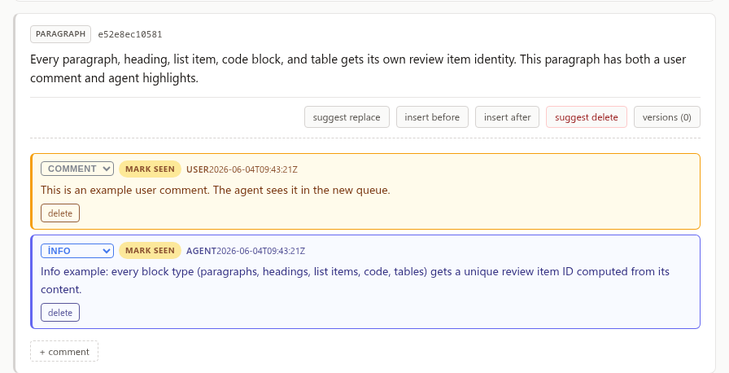
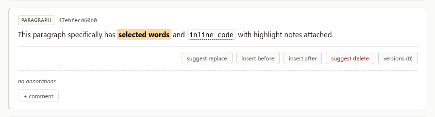
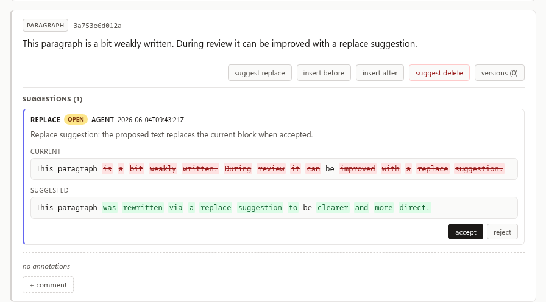
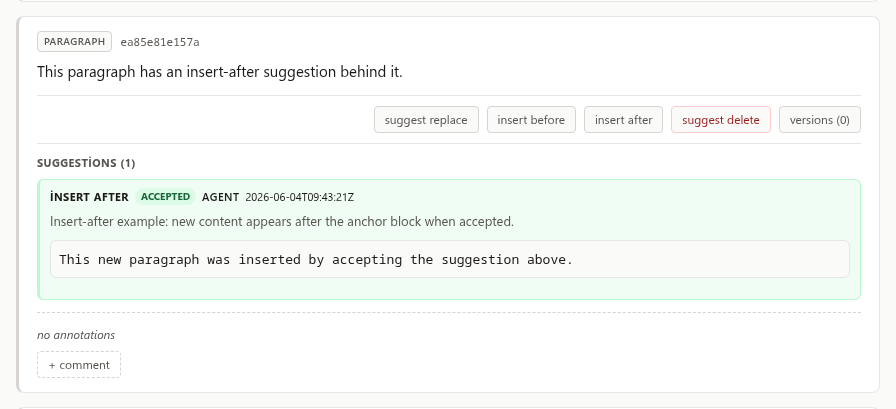
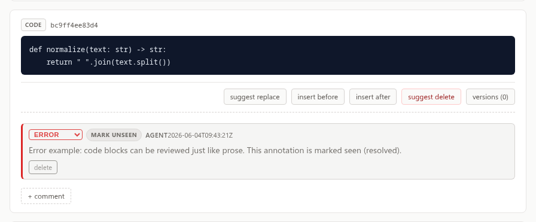
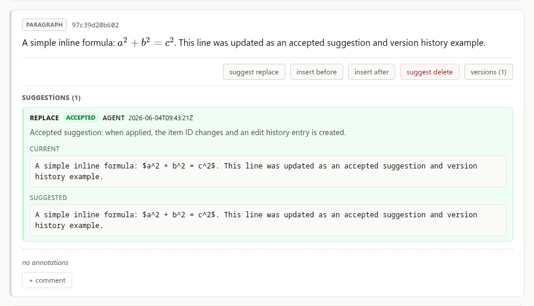
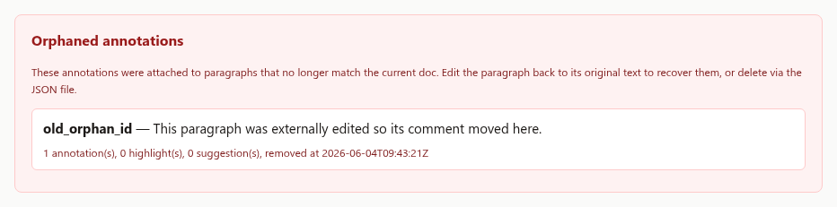

# markdown-review

> **Review Markdown like a code review — annotations, highlights, suggestions, and source edits, all tracked in a sidecar JSON file.**

A block-level Markdown review tool that renders any `.md` file in a local web UI. You highlight text, leave comments, propose source changes, and an AI agent replies — everything stored alongside your document in `<doc>.annotations.json`. No database, no setup, no noise.

---

## What does it look like?

Run `markdown-review demo.md` to see it live — `demo.md` comes pre-seeded with examples of every feature.

### Annotations

User and agent annotations appear below each review item, color-coded by author and type (`info`, `error`, `task`, `comment`).



### Highlights

Marker highlights (solid background) draw attention. Underline highlights (dotted) gloss terms — hover to see the note.



### Suggestions — open

Propose a replacement without touching the file. Accept or reject from the suggestion panel.



### Suggestions — accepted

Accepted suggestions apply to the file and show their applied status inline. The tool tracks `before → after` version history.



### Code review

Code blocks are first-class review items. Annotate them with `error`, `info`, or any type — just like prose paragraphs.



### Math & edit history

KaTeX renders natively. When source changes through the tool, version history records every `before → after` edit.



### Orphan tracking

If an item disappears from the source (e.g. edited outside the tool), its review data moves to the orphan panel instead of being lost.



---

## Why?

| Problem | markdown-review |
|---|---|
| Review comments scattered across GitHub issues, Slack, and email | Everything lives in one sidecar JSON, next to the doc |
| Can't comment on individual list items or code blocks | Every block gets its own review ID |
| No history of what changed | Edits track `before → after` with IDs and timestamps |
| AI agent has no structured way to reply | `markdown-review add` + `--author agent` gives AI a clean API |

---

## Quick Start

```bash
# Clone & install
git clone https://github.com/onesvat/markdown-review
cd markdown-review
uv venv && uv sync

# Try the demo (pre-loaded with examples)
markdown-review demo.md

# Or review your own doc
markdown-review ~/my-thesis/chapter-3.md
```

---

## CLI Reference

### Viewing & listing

```bash
# Open a doc in the browser
markdown-review /abs/path/to/doc.md

# Run the server headless on a custom port
markdown-review serve --port 8765 --no-open

# List all reviewable items with IDs, line ranges, and previews
markdown-review items /abs/path/to/doc.md --json

# Scope to a specific section or line range
markdown-review items /abs/path/to/doc.md --section "Introduction"
markdown-review items /abs/path/to/doc.md --from-line 35 --to-line 88

# See what's new / unseen
markdown-review new /abs/path/to/doc.md --json
```

### Annotations

```bash
# Mark an annotation seen or unseen
markdown-review mark-seen <annotation_id> --path /abs/path/to/doc.md
markdown-review mark-unseen <annotation_id> --path /abs/path/to/doc.md

# Add an agent annotation
markdown-review add \
  --path /abs/path/to/doc.md \
  --item-id <item_id> \
  --author agent \
  --type comment \
  --text "Reply or note"
```

### Highlights

```bash
# Underline a term with a gloss
markdown-review highlight \
  --path /abs/path/to/doc.md \
  --item-id <item_id> \
  --selected-text "exact visible text" \
  --style underline \
  --text "Turkish gloss or explanation"

# Marker highlight for emphasis
markdown-review highlight \
  --path /abs/path/to/doc.md \
  --item-id <item_id> \
  --selected-text "important phrase" \
  --style marker \
  --text "Why this matters"
```

### Suggestions

```bash
# Replace an entire block
markdown-review suggest \
  --path /abs/path/to/doc.md \
  --item-id <item_id> \
  --action replace \
  --raw - \
  --note "Why this change helps"

# Replace one phrase inside a block
markdown-review suggest \
  --path /abs/path/to/doc.md \
  --item-id <item_id> \
  --action inline-replace \
  --selected-text "old phrase" \
  --occurrence 0 \
  --raw "new phrase"

# List open suggestions
markdown-review suggestions /abs/path/to/doc.md --json
```

---

## Sidecar JSON

All review data lives in `<doc>.annotations.json` alongside your document:

```jsonc
{
  "schema_version": 2,
  "doc_path": "/abs/path/to/doc.md",
  "updated_at": "2026-06-04T12:00:00Z",
  "doc_revision_id": "<sha1-of-current-markdown>",
  "paragraphs": {
    "<item_id>": {
      "id": "<stable-uuid>",
      "preview": "first ~120 chars",
      "block_type": "paragraph|heading|code|...",
      "content_hash": "<sha1-prefix-of-current-item-source>",
      "source_start_line": 12,
      "source_end_line": 13,
      "source_start": 240,
      "source_end": 315,
      "annotations": [
        {
          "id": "<uuid>",
          "author": "user|agent",
          "type": "info|error|task|comment",
          "text": "...",
          "seen": false,
          "ts": "..."
        }
      ],
      "suggestions": [
        {
          "id": "<uuid>",
          "author": "user|agent",
          "action": "replace|delete|insert_before|insert_after|inline_replace",
          "anchor_id": "<item_id>",
          "raw": "suggested markdown",
          "note": "...",
          "status": "open|accepted|rejected|needs_resolution",
          "hunks": [
            {
              "item_id": "<item_id>",
              "base_revision_id": "<doc_revision_id-at-creation>",
              "base_item_hash": "<item-source-hash-at-creation>",
              "base_item_text": "original item source",
              "start": 10,
              "end": 20,
              "old_text": "old phrase",
              "new_text": "new phrase",
              "prefix_context": "...",
              "suffix_context": "...",
              "kind": "replace|delete|insert",
              "placement": "inside|before|after"
            }
          ],
          "ts": "..."
        }
      ],
      "edits": [
        {
          "id": "<uuid>",
          "author": "user|agent",
          "old_id": "<previous id>",
          "new_id": "<new id>",
          "before": "old source",
          "after": "new source",
          "ts": "..."
        }
      ]
    }
  },
  "orphans": []
}
```

- **Item IDs** are stable UUIDs. Content hashes are metadata used for reconciliation, not public anchors.
- **Orphans** hold review data for items that disappeared from the document.
- **Suggestions** store patch hunks with source ranges, old text, new text, context, and base revision metadata.
- **Edits** record `before → after` history per item when source changes are accepted through the tool.

---

## Suggestions

Suggestions are proposed source changes that don't touch the file until explicitly accepted:

| Action | What it does |
|---|---|
| `replace` | Replace the entire review item |
| `delete` | Remove the item from the file |
| `insert_before` | Insert Markdown before the item |
| `insert_after` | Insert Markdown after the item |
| `inline_replace` | Replace selected text within the item |

Accepting applies the stored patch hunk and marks it `accepted`. Rejecting marks it `rejected`. If the item changed, the server first rebases the hunk through the item diff, then falls back to unique context matching. If the hunk is ambiguous or the old text changed, the suggestion becomes `needs_resolution` and the file is left unchanged.

Inline suggestions can render directly on the text, but the suggestions panel is the reliable accept/reject surface. Acceptance uses source hunks, not DOM occurrence matching.

---

## API

| Method | Path | Description |
|---|---|---|
| `GET` | `/api/doc?path=<abs>` | Live parse + review overlay |
| `GET` | `/api/annotations?path=<abs>` | Raw sidecar JSON |
| `POST` | `/api/annotations` | Add annotation `{path, paragraph_id, text, author, type?, seen?}` |
| `PATCH` | `/api/annotations/{id}` | Update annotation `{path, seen?, text?, type?}` |
| `DELETE` | `/api/annotations/{id}?path=<abs>` | Remove annotation |
| `POST` | `/api/suggestions` | Propose change `{path, anchor_id, action, author, raw?, selected_text?, occurrence?, note?}` |
| `PATCH` | `/api/suggestions/{id}` | Update status/note `{path, status?, note?}` |
| `POST` | `/api/suggestions/{id}/apply` | Apply suggestion `{path}` |
| `PATCH` | `/api/items/source` | Legacy direct source edit |
| `GET` | `/figures?src=<rel>&doc=<abs>` | Serve figure relative to doc dir |

---

## Design Notes

- **Item IDs** are stable UUIDs. Replacing source preserves the item ID.
- **Annotations** track `seen: true|false`.
- **Schema v2 only** — old sidecars must be migrated with `scripts/migrate_v1_sidecar.py <doc.md>`.
- **Orphans** — if you edit the Markdown outside the tool and an item disappears, its data moves to `orphans` rather than being lost.
- **Authorship** — the UI comment form always creates `author=user`. CLI/API can set `author=agent` for AI-authored remarks.
- **No database** — everything is in the sidecar JSON. Commit it alongside your docs.
- **Local by default** — `--host 0.0.0.0` exposes the UI to the network; use cautiously.

---

## Development

```bash
uv sync          # install dependencies
uv run pytest    # run tests
```

## Skill

This repo includes a published skill at `skills/markdown-review/` that teaches AI agents how to use the `markdown-review` CLI for structured, turn-based review workflows. The skill is for agents consuming the tool — it's not required for developing the tool itself.
